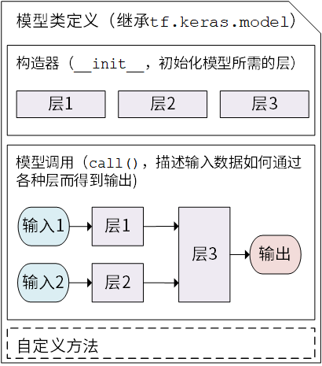

# 实验1：手写数字识别

## 实验内容

搭建Tensorflow的卷积神经网络，实现手写数字是识别。

### 数据集

MNIST数据集是NIST（美国国家标准与技术研究院）收集大型手写数字的数据子集。其包含训练集60000个，测试集10000个。所有的图像固定28×28尺寸、均为灰度图像、且图像居中。可在http://yann.lecun.com/exdb/mnist/下载数据集。


### 网络架构


- 输入：归一化的28×28灰度图像
- 第1卷积层：32个5×5卷积核对28×28的输入图像卷积，步长为1，激活函数采用ReLU，得到32×28×28的特征图
- 第2池化层：对32×28×28的特征图进行池化，步长为2，池化核大小2×2，得到32×14×14的特征图
- 第3卷积层：64个5×5卷积核对32×14×14的特征图卷积，步长为1，激活函数采用ReLU，得到64×14×14的特征图
- 第4池化层：对64×14×14的特征图进行池化，步长为2，池化核大小2×2，得到64×7×7的特征图
- 第5、6、7全连接层：将第4池化层得到64×7×7的特征图展开为3136单元，送入第5、第6、第7全连接层，然后softmax输出10类。

## 实验环境

### 运行依赖

Python3.8.8

- tensorflow-2.2：神经网络框架
- matplotlib：绘图工具包
- numpy：科学计算包
- datetime：时间管理器
- os：系统文件管理器

### 运行环境

GPU：GeoForce GTX 1660 Ti with Max-Q Design

## 实验原理

### 数据预处理

`data_loader.py`负责加载数据集、划分训练集、测试集和部分数据预处理。其代码如下。

```python
'''
Author: snake8859
Date: 2021-04-21 10:43:45
LastEditTime: 2021-05-18 14:35:50
LastEditors: Please set LastEditors
Description: 手写体数据集加载器
FilePath: \code\data_loader.py
'''

import numpy as np
import tensorflow as tf
import matplotlib.pyplot as plt

class MNISTLoader():
    '''MNIST 数据获取和预处理'''
    def __init__(self):
        # 自动下载MNIST数据集
        mnist = tf.keras.datasets.mnist
        # 训练集和测试集划分
        (self.train_data, self.train_label), (self.test_data, self.test_label) = mnist.load_data()

        # 训练集和测试集增加一个颜色通道维度，其值为像素值(unint8)归一化到0-1(float32)
        '''
            在 TensorFlow 中，图像数据集的一种典型表示是 [图像数目，长，宽，色彩通道数] 的四维张量。
        '''
        self.train_data = np.expand_dims(self.train_data.astype(np.float32) / 255.0, axis = -1) # [60000, 28, 28, 1]
        self.test_data = np.expand_dims(self.test_data.astype(np.float32) / 255.0, axis = -1) # [10000, 28, 28, 1]

        self.train_label = self.train_label.astype(np.int32) # [60000]
        self.test_label = self.test_label.astype(np.int32) # [10000]

        # 计算训练集和测试集的个数
        self.num_train_data, self.num_test_data = self.train_data.shape[0], self.test_data.shape[0]

    def get_batch(self, batch_size):
        '''
        @description: 随机从数据集取出batch_size个数据对象并返回
        @param 
            batch_size 每批数据对象个数
        @return 
            train_data  数据
            train_label 标签
        '''
        index = np.random.randint(0, self.num_train_data, batch_size)
        return self.train_data[index, :], self.train_label[index]


    def show_img(self, batch_size = 16):
        '''
        @description: 显示数据和标签
        @param 
            batch_size 显示数据个数, 默认16
        @return None
        '''
        show_data, show_label = self.get_batch(batch_size)
        # print(show_data.shape, show_data.dtype, type(show_data)) # (batch_size, 28, 28, 1)
        col = 0
        for i in range(batch_size):
            img = show_data[i]
            img_label = show_label[i]
            # print(img.shape, img_label.shape) # (28, 28, 1)
            cur_spec = (col, i % 4)
            if (i + 1) % 4 == 0: # 每4个换行
                col +=1
            plt.subplot2grid((4, 4), cur_spec)
            plt.imshow(img, cmap='gray')
            plt.title(img_label)
            plt.axis('off')

        plt.show()


if __name__ == "__main__":
    data_loader = MNISTLoader()
    data_loader.show_img(16)
```

### 构建神经网络

#### 复杂式网络构建

`handwriting_recognition_complex.py`中采用面向对象方式构建卷积神经网络，其代码如下。

```python
class CNN(tf.keras.Model):
    '''
        模型构建:
            卷积神经网络的结构和多层感知器结构类似，只是在多层感知器之前新加入一些卷积层和池化层。
            卷积层和池化层主要用于图像的特征提取，它是基于大脑的视觉皮层启发，引入感受野（Receptive Field）这一概念。
            【视觉皮层中的神经元并非与前一层的所有神经元相连，而只是感受这一片区域内的视觉信号，并只对局部区域的视觉刺激进行反应】
            CNN的卷积层正体现这一特性。
    '''
    def __init__(self):
        super().__init__()
        # 定义网络第1层：卷积层
        self.conv1 = tf.keras.layers.Conv2D(
            filters = 32, # 卷积核个数
            kernel_size = [5, 5], # 卷积大小（感受野大小）
            padding = 'same', # padding策略(vaild 或 same)
            activation=tf.nn.relu # 激活函数
        )

        # 定义网络第2层：池化层
        self.pool1 = tf.keras.layers.MaxPool2D(
            pool_size = [2, 2], # 池化核大小
            strides= 2 # 卷积步长
        )

        # 定义网络第3层：卷积层
        self.conv2 = tf.keras.layers.Conv2D(
            filters = 64,
            kernel_size = [5,5],
            padding = "same",
            activation= tf.nn.relu
        )

        # 定义网络第4层：池化层
        self.pool2 = tf.keras.layers.MaxPool2D(
            pool_size= [2,2],
            strides= 2
        )

        # 定义网络第5层：特征拉值
        self.flatten = tf.keras.layers.Reshape(target_shape = (7 * 7 * 64, ))


        # 定义网络第6层：全连接层
        self.dense1 = tf.keras.layers.Dense(
            units = 1024, # 神经元个数
            activation=tf.nn.relu # 激活函数
        )

        # 定义网络第7层：全连接层
        self.dense2 = tf.keras.layers.Dense(
            units = 64, 
            activation = tf.nn.relu
        )

        # 定义网络第8层：全连接层
        self.dense3 = tf.keras.layers.Dense(
            units = 10
        )
        

    def call(self, inputs):
        '''
        @description: 前向传播
        @param 
            inputs 输入向量
        @return 
            output 输出分类结果
        '''
        c1 = self.conv1(inputs) # [batch_size, 28, 28, 32]
        p1 = self.pool1(c1) # [batch_size , 14 ,14 ,32]
        c2 = self.conv2(p1) # [batch_size, 14, 14, 64]
        p2 = self.pool1(c2) # [batch_size, 7, 7, 64]
        f = self.flatten(p2) # [batch_size, 3136]
        d1 = self.dense1(f) # [batch_size, 1024]
        d2 = self.dense2(d1) # [batch_size, 64]
        d3 = self.dense3(d2) # [batch_size, 10]
        output = tf.nn.softmax(d3) # [batch_size, 10]
        return output
```

面向对象的继承方式构建神经网络，主要通过创建类，然后继承`tf.kearas.Model`。在继承类中，主要是重写`__init__()`（构造函数）和`call(input)`（模型调用）两个方式。



网络的各层定义，主要是通过`tf.keras.layers.*`定义，其中`Dense`为全连接层，`Conv2D`是卷积层，`MaxPool2D`是最大池化层。他们核心参数如下。

- Dense

  ```python
  tf.keras.layers.Dense(
      units, activation=None, use_bias=True, kernel_initializer='glorot_uniform',
      bias_initializer='zeros', kernel_regularizer=None, bias_regularizer=None,
      activity_regularizer=None, kernel_constraint=None, bias_constraint=None,
      **kwargs
  )
  ```

  - units：神经元个数
  - activation：激活函数
  - use_bias：是否使用偏置
  - kernel_initializer：神经元初始化方式
  - bias_initializer：偏置初始化方式

  具体可参考：https://tensorflow.google.cn/versions/r2.2/api_docs/python/tf/keras/layers/Dense

- Conv2D

  ```python
  tf.keras.layers.Conv2D(
      filters, kernel_size, strides=(1, 1), padding='valid', data_format=None,
      dilation_rate=(1, 1), activation=None, use_bias=True,
      kernel_initializer='glorot_uniform', bias_initializer='zeros',
      kernel_regularizer=None, bias_regularizer=None, activity_regularizer=None,
      kernel_constraint=None, bias_constraint=None, **kwargs
  )
  ```

  - filters：卷积核个数
  - kernel_size：卷积核大小
  - strides：卷积步长
  - padding：填充方式
  - activation：激活函数
  - use_bias：是否使用偏置
  - kernel_initializer：卷积核初始化方式
  - bias_initializer：偏置初始化方式

  具体可参考：https://tensorflow.google.cn/versions/r2.2/api_docs/python/tf/keras/layers/Conv2D

- MaxPool2D

  ```python
  tf.keras.layers.MaxPool2D(
      pool_size=(2, 2), strides=None, padding='valid', data_format=None, **kwargs
  )
  ```

  - pool_size：池化大小
  - strides：池化步长
  - padding：填充方式

  具体可参考：https://tensorflow.google.cn/versions/r2.2/api_docs/python/tf/keras/layers/MaxPool2D

#### 简单式网络构建

对于简单的神经网络，一般通过一堆层按照特定顺序叠加起来，那么可以采用Sequential API方式建立神经网络。其代码如下。

```python
'''
    Keras Sequential API 方式创建简单网络模型；
    通过向tf.kears.models.Sequential()提供一个层的列表，快速建立一个tf.kears.Model模型
'''

# CNN模型
cnn_modle = tf.keras.models.Sequential([
    tf.keras.layers.Conv2D(filters = 32, kernel_size = [5,5], padding = 'same', activation= tf.nn.relu), # 第1卷积层
    tf.keras.layers.MaxPool2D( pool_size = [2, 2],strides= 2), # 池化层
    tf.keras.layers.Conv2D(filters = 64, kernel_size = [5,5], padding = 'same', activation= tf.nn.relu), # 第2卷积层
    tf.keras.layers.MaxPool2D( pool_size = [2, 2],strides= 2), # 池化层
    tf.keras.layers.Flatten(), # 将图片拉直为一维向量
    tf.keras.layers.Dense(units = 100, activation = tf.nn.relu), # 隐含层：100个神经元，激活函数ReLU
    tf.keras.layers.Dense(units = 10, activation = tf.nn.softmax) # 输出层：10个神经元，激活函数softmax
])
```

### 训练和测试

#### 训练

- 主动式训练

  所谓主动式训练是指用户主动获取小批量数据，然后调用模型，计算损失，然后进行梯度更新，保存参数和记录训练细节等。其中每一步都由用户主动调用相关函数实现，其自由度大，但过程相对复杂。其代码如下。

  ```python
  def train(num_epochs, batch_size, num_batches, learning_rates, log_dir, save_dir):
      '''
      @description: 模型训练
      @param 
          num_epochs 
          batch_size 
          num_batches 
          learning_rates
          log_dir 
          save_dir
      @return model
      '''
      # 模型实例化
      model = CNN()
      # 实例化模型优化器
      optimizer = tf.keras.optimizers.Adam(learning_rate=learning_rate) # Adam优化器
      # 实例化CheckPoint，设置保存模型对象
      check_point = tf.train.Checkpoint(myMode = model)
      # 实例化记录器
      summary_writer = tf.summary.create_file_writer(log_dir)
  
      # 迭代训练
      for batch_index in range(num_batches):
          x, y_true = dataLoader.get_batch(batch_size) # 每次迭代随机取batch_size个数据
          # print(x, x.shape, type(x))
          # print(y_true, y_true.shape, type(y_true))
          # break
          # 计算损失
          with tf.GradientTape() as tape:
              y_pred = model(x)
              # 交叉熵损失
              loss = tf.keras.losses.sparse_categorical_crossentropy(y_true = y_true, y_pred = y_pred) # batch_size个样本的交叉熵损失综合
              loss = tf.reduce_mean(loss) # batch_size个样本的交叉熵损失平均
              print("batch {0}: loss {1}".format(batch_index + 1, loss.numpy()))
              loss_list.append(loss.numpy()) # 记录损失
          if batch_index % 1000 == 0: # 每隔1000个Batch保存一次模型
              path = check_point.save(save_dir + '/mnist_model.ckpt')
              print('model saved to {0}'.format(path))
              # 开启记录器上下文环境
              with summary_writer.as_default():
                  tf.summary.scalar('loss', loss, step = batch_index) # 记录当前损失值
  
          # 计算损失函数关于权重的梯度
          grads = tape.gradient(loss, model.variables)
          # 根据梯度下降，更新权重
          optimizer.apply_gradients(grads_and_vars = zip(grads, model.variables))
  
      # 绘制损失变化状态
      batch_np = np.arange(0, num_batches)
      loss_np = np.array(loss_list)
      fig, ax = plt.subplots()
      ax.plot(batch_np, loss_np)
      ax.set(xlabel='num_step', ylabel='loss',
         title='loss state')
      ax.grid()
      # plt.show()
      plt.savefig('Handwriting_LOSS_{0}.png'.format(num_batches))
  
      return model
  ```

- 配置式训练

  所谓配置式训练是指，通过指定模型采用的优化器、损失函数和评估指标，调用`compile`配置模型；接着给模型加载相应要求的数据、定义批次大小、迭代次数和记录器，调用`fit`适配模型，进行训练；最后通过`save`方法保存模型。其过程中用户主要关心模型所需要各种适配器（优化器、损失函数、评估器、记录器等）和训练基本信息（data、batch_size、epochs），具体的训练细节交予框架实现。其代码如下。

  ```python
  '''
      当模型建立完成后，通过tf.kears.Model的complie方法，配置训练过程
  '''
  
  # 模型配置
  cnn_modle.compile(
      optimizer = tf.keras.optimizers.Adam(learning_rate = 0.001), # 优化器
      loss = tf.keras.losses.sparse_categorical_crossentropy, # 损失函数
      metrics = [tf.keras.metrics.sparse_categorical_accuracy] # 评估指标 
  )
  
  '''
      当模型配置完成后，通过tf.kears.Model的fit方法训练模型
  '''
  
  # 实例化数据对象
  dataLoader = MNISTLoader()
  
  # 创建TensorBoard回调函数
  fit_log_dir = './tensorboard/bySimple/' + datetime.datetime.now().strftime("%Y%m%d-%H%M%S")
  tensorboard_callback = tf.keras.callbacks.TensorBoard(
      log_dir = fit_log_dir, # 输出路径
      histogram_freq = 1, # 统计每层直方图
      profile_batch = 0, # 不启动profile
      update_freq = 'batch' # 更新频次，以batch
  )
  os.makedirs(fit_log_dir + '/train/') # 创建目录
  
  cnn_modle.fit(
      x = dataLoader.train_data, # 训练数据
      y = dataLoader.train_label, # 标签数据
      validation_split=0.3, # 验证集划分
      batch_size = 50, # 批次大小
      epochs = 5, # 将训练数据迭代多少次
      callbacks = [tensorboard_callback] # tensorboard回调函数
  )
  
  '''
      当模型训练完成之后，保存模型
  '''
  save_path = './save/bySimple/'
  tf.saved_model.save(cnn_modle, save_path)
  ```

#### 测试

可以通过两种方式进行测试，一种是基于复杂式网络构建，具体过程是定义模型评估器，然后主动记录模型的性能；另一种基于简单式网络构建，是直接调用模型的`evaluate`评估训练效果。

```python
def evaluation(batch_size, model):
    '''
    @description: 模型评估
    @param 
        batch_size 
        model 训练模型
    @return None
    '''     

    # # 模型评估
    # '''
    #     这里使用tf.keras.metrics中的 SparseCategoricalAccuracy 评估器来评估模型在测试集上的性能。
    #     过程：
    #         1.迭代测试集数据，利用模型预测估计值，然后调用update_state(y_pred, y_true)，来计算预测值和真实值的误差。
    #         2.迭代结束后，调用result()输出最终的评估指标值（预测正确的样本占总样本的比例）
    # '''

    # 实例化模型评估器
    sparse_categorical_accuracy =  tf.keras.metrics.SparseCategoricalAccuracy()

    num_batches_test = int(dataLoader.num_test_data // batch_size) # 计算迭代次数：每次取batch_size个测试集数据

    for batch_index in range(num_batches_test):
        # 计算测试集样本的切片
        start_index, end_index = batch_index * batch_size, (batch_index + 1) *batch_size
        # 计算模型预测值
        y_pred = model.predict(dataLoader.test_data[start_index: end_index]) # [batch_size, 10]
        # print(y_pred, y_pred.shape, type(y_pred))
        y_true = dataLoader.test_label[start_index: end_index]
        # print(y_true, y_true.shape, type(y_true))
        # 评估器进行评估
        sparse_categorical_accuracy.update_state(y_true= y_true, y_pred = y_pred)
    # 输出评估的结构
    print("test accuracy: {0}".format(sparse_categorical_accuracy.result()))
    '''
        test accuracy: 0.9894000291824341
    '''
```

```python
'''
    当模型训练完成之后，通过tf.kears.Model的evaluate评估训练效果
'''

print('test accuracy: {0}'.format(cnn_modle.evaluate(
    dataLoader.test_data,
    dataLoader.test_label   
)))
```

## 实验结果

利用tensorflow自带的tensorboard将训练过程可视化，其中损失和正确率曲线如下图所示。（蓝色验证集，橙色训练集）

- 损失函数


- 正确率

  

