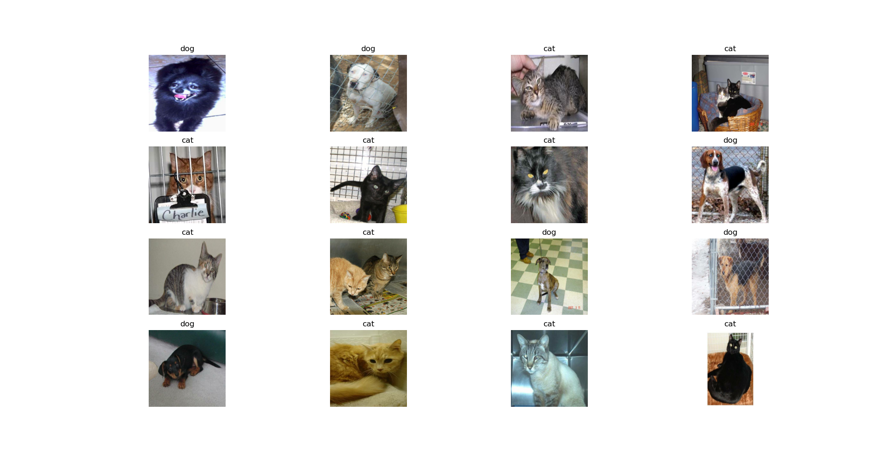
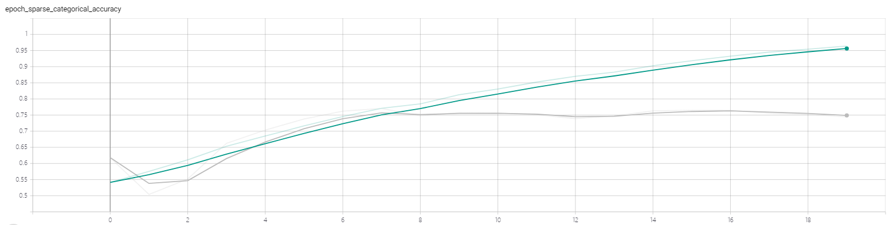
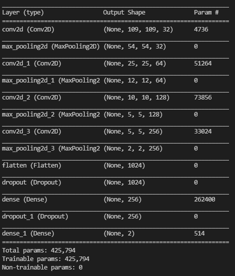
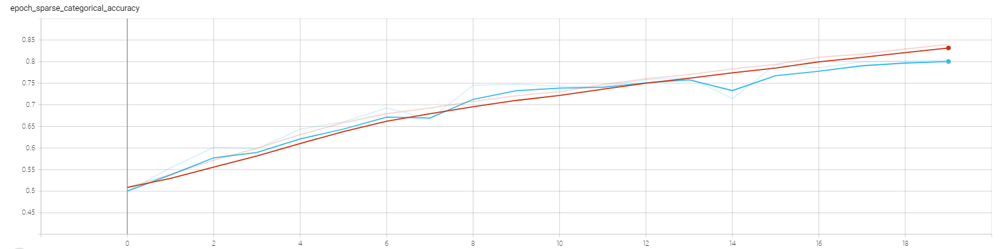
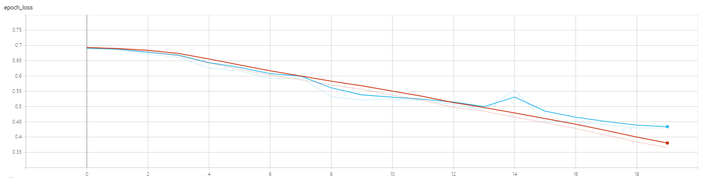
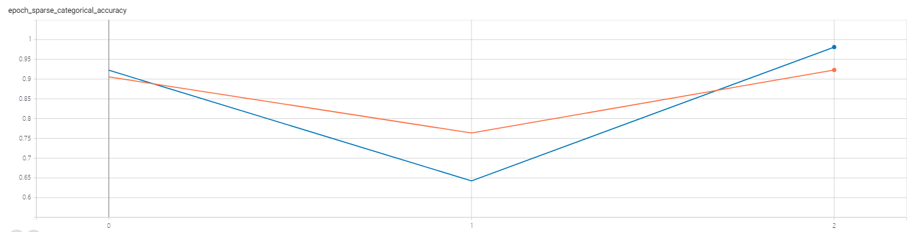
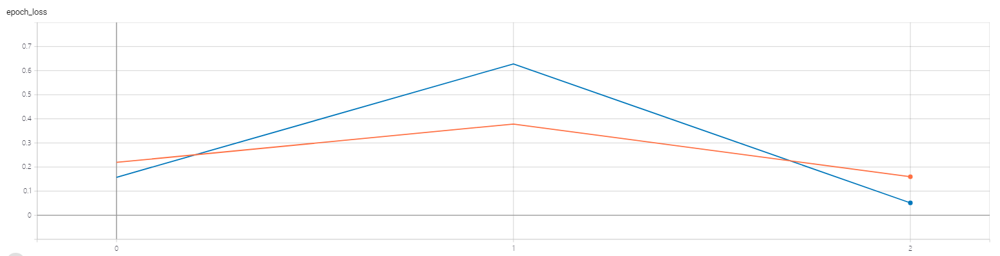

# 实验2：猫狗分类

## 实验内容

基于Tensorflow搭建卷积神经网络，实现猫狗分类。

### 数据集

猫狗分类的数据集来源Kaggle上的一个名为Cats vs. Dogs（猫狗大战）竞赛，该数据集包含训练集25000张彩色图像，图像的尺寸不固定，猫狗类别各占一半。数据集可在：https://www.kaggle.com/c/dogs-vs-cats/overview 下载。

本次实验由于受到机器性能限制，仅采用15000张图像，其中10000张图像作为训练集，2000张图像作为验证集，3000张图像作为测试集，所有数据集中猫狗类别各占一半。



## 实验环境

### 运行依赖

Python3.8.8

- tensorflow-2.2：神经网络框架
- matplotlib：绘图工具包
- datetime：时间管理器
- os：系统文件管理器

### 运行环境

GPU：GeoForce GTX 1660 Ti with Max-Q Design

## 数据预处理

### 图像文件 To DataSet

`data_loader.py`脚本实现负责将图像文件转为DataSet

```python
class CatDogLoader():
    def __init__(self, file_list, buffer_size, batch_size, num_epoch):
        # print(file_list[0:10])
        self.image_data = {}
        # 遍历文件
        for file_path in file_list:
            file_root, file_name = os.path.split(file_path)
            label = file_name.split('.')[0]
            label_name = None
            # 根据文件名打标签
            if(label == 'cat'):
                label_name = 0
            elif(label == 'dog'):
                label_name = 1
            
            if(label_name != None):
                self.image_data[file_path] = label_name
        # print(self.image_data)

        all_image_path = list(self.image_data)
        all_image_label = list(self.image_data.values())
        ds = tf.data.Dataset.from_tensor_slices((all_image_path, all_image_label))

        image_label_ds = ds.map(self.load_and_preprocess_image)
        # buffer_size（随机缓冲区大小）:设置一个和数据集大小一致的 shuffle, 以保证数据被充分打乱
        image_label_ds = image_label_ds.shuffle(buffer_size = buffer_size)
        # batch:数据打包分组,每batch_size个分数据成一组
        image_label_ds = image_label_ds.batch(batch_size)
        # count:数据重复多少epoch, 训练的轮数
        self.image_label_ds = image_label_ds.repeat(count = num_epoch)


    def load_and_preprocess_image(self, path, label):
        image = tf.io.read_file(path)
        image = tf.image.decode_jpeg(image, channels = 3)  # 编码图像
        image = tf.image.resize(image, (224, 224)) # 图像统一尺寸
        image /= 255.0 # 图像归一化到[0-1]
        return image, label
```

- os库用于读取文件名，并标记类别。
- 利用`tf.data.Dataset.from_tensor_slices`构建Dataset文件列表，调用`map`方式批加载和预处理数据，然后调用`shuffle`打乱数据，`batch`将数据分批。

### TFRecord To DataSet

TFRecord是TensorFlow中的数据集存储格式，可以高效地读取和处理数据集。它可以理解为一系列序列化的`tf.train.Example`元素所组成的列表文件，每一个`tf.train.Example`又由若干个`tf.train.Feature`的字典组成。`createSmallRecord.py`实现读取图像文件，创建TFRecord文件，并转化为DataSet。

```python
def create_tfrecord(root, all_filenames, tfrecord_dir):
    '''
        创建tfrecord文件
    '''
    # 创建标签
    all_labels = []
    for fname in all_filenames:
        if(fname.startswith('cat')):
            all_labels.append(0)
        elif(fname.startswith('dog')):
            all_labels.append(1)   
         
    # TFrecord创建上下文环境
    with tf.io.TFRecordWriter(tfrecord_dir) as writer:
        # 遍历原始数据
        for filename, label in zip(all_filenames, all_labels):
            # 读取图片
            file_path = os.path.join(root, filename)
            print(file_path, label)
            image = open(file_path, 'rb').read()
            # 创建Feautre
            feature = {
                'image': tf.train.Feature(bytes_list = tf.train.BytesList(value = [image])), # 图片是Bytes对象
                'label': tf.train.Feature(int64_list = tf.train.Int64List(value = [label])) # 标签是Int对象
            }
            # 创建Example
            example = tf.train.Example(features  = tf.train.Features(feature = feature))

            # 序列化写入TFRecord文件
            writer.write(example.SerializeToString())


def read_tfrecord(tfrecord_dir):
    '''
        读取TFRecord文件
    '''
    raw_dataset = tf.data.TFRecordDataset(tfrecord_dir) # 读取TFRecord文件
    dataset = raw_dataset.map(_parse_example).shuffle(3000).batch(16)

    for images, labels in dataset:
        # print(image.shape, type(image)) (16, 299, 299, 3)
        # print(label.shape, type(label)) (16,)
        col = 0
        for i in range(16):
            img = images[i]
            img_label = labels[i]
            # print(img.shape, img_label.shape) # (28, 28, 1)
            cur_spec = (col, i % 4)
            if (i + 1) % 4 == 0: # 每4个换行
                col +=1
            plt.subplot2grid((4, 4), cur_spec)
            plt.imshow(img.numpy(), cmap='gray')
            plt.title('cat' if img_label == 0 else 'dog')
            plt.axis('off')

        plt.show()
        break


def _parse_example(example_string):
    '''
        对TFRecord文件中的每一个序列化文件的tf.train.Example解码
    '''
    feature_dict = tf.io.parse_single_example(example_string, feature_desciption)
    # print(feature_dict)
    feature_dict['image'] = tf.io.decode_jpeg(feature_dict['image']) # 解码JPGE图像
    image_resized = tf.image.resize(feature_dict['image'], [299, 299]) / 255
    return image_resized, feature_dict['label']
```

**TFRecord创建：**

- 将数据转为tf.train.Feature
- 将Feature转为Example
- 将Example序列化，写入TFRecord文件

  **TFRecord读取：**

- 通过tf.Data.TFrecordDataset读取原始的TFRecord文件，得到Dataset对象
- 通过Dataset.map方法，将数据集每一个序列化的Example对象，通过tf.io.parse_single_example反序列化

## 实验结果

### V1

#### 基本版

6层：4卷积层+2全连接层

**特点：**

- 在浅层的感受野较大，深层的感受野较小
- 随着层数增加，特征图通道越多，尺寸越小
- 全连接层的神经元差异较小，参数量较小

**缺点：**

- 容易过拟合
- 陷入局部最优解


**训练集和测试集结果曲线：（绿色训练集、灰色验证集）**

- 训练细节
  - batch_size：10
  - epoch：20
  - learning_rate：0.01
  - momentum：0.001
  - 优化方法：随机梯度下降
  - 损失函数：交叉熵损失函数

- 正确率

  

- 损失

  

从训练过程中的验证集正确率曲线中以看到，训练集的正确率不断提高（95%），但是验证集的正确率仅有75%左右，说明模型出现过拟合现象。

#### 改良版

在基础版的基础上，使用Dropout策略，避免过拟合；

6层：4卷积层+2全连接层+Dropout



**训练集和测试集结果曲线：（红色训练集、蓝色验证集）**

- 训练细节

  - batch_size：10
  - epoch：20
  - learning_rate：0.01
  - momentum：0.001
  - 优化方法：随机梯度下降（SGD）
  - 损失函数：交叉熵损失函数

- 正确率

  

- 损失

  

从训练过程中的验证集正确率曲线中以看到，训练集正确率和验证集正确率都再同步提高，最终达到**80%左右**，模型没有出现过拟合现象，但是模型的到达了性能瓶颈（**80%左右**）。

### V2

经典的卷积神经网络，如VGGNet、GoogleNet和ResNet，是优秀的图像分类网络。实验通过采用VGG-16、InceptionV3、Res-50三款在ImageNet预训练的模型，由于它们之前是针对1000分类，所有实验中只**利用它们的卷积层提取图像特征，再通过自定义的全连接层用于分类。**

#### VGG-16


3层全连接层：

- Dense1：256神经元，激活函数ReLU
- Dense2：64神经元，激活函数ReLU
- Dense3：2神经元，激活函数softmax

**训练集和测试集结果曲线：（红色训练集、蓝色验证集）**

- 训练细节
  - batch_size：10
  - epoch：3
  - learning_rate：0.01
  - momentum：0.001
  - 优化方法：随机梯度下降（SGD）
  - 损失函数：交叉熵损失函数

- 正确率

  

- 损失

  

预训练的VGG-16模型比较强大，在训练早期，1-3epoch内就可以收敛，由于选用SGD优化方法，会存在正确率和损失的震荡。最终训练集和验证集正确率均达到95%以上，测试集正确率为97.76%。

#### InceptionV3


3层全连接层：

- Dense1：512神经元，激活函数ReLU
- Dense2：128神经元，激活函数ReLU
- Dense3：2神经元，激活函数softmax

**训练集和测试集结果曲线：（蓝色训练集、红色验证集）**

- 训练细节
  - batch_size：10
  - epoch：10
  - learning_rate：0.01
  - momentum：0.001
  - 优化方法：随机梯度下降（SGD）
  - 损失函数：交叉熵损失函数

- 正确率

  

- 损失

  

预训练的InceptionV3也十分强大，在较短的训练时间下训练集和验证集就能达到95%以上的正确率，最终的测试集上的正确率为**98.2%**。

#### Res-50


3层全连接层：

- Dense1：512神经元，激活函数ReLU
- Dense2：128神经元，激活函数ReLU
- Dense3：2神经元，激活函数softmax

**训练集和测试集结果曲线：（蓝色训练集、红色验证集）**

- 训练细节
  - batch_size：10
  - epoch：3
  - learning_rate：0.01
  - momentum：0.001
  - 优化方法：随机梯度下降（SGD）
  - 损失函数：交叉熵损失函数

- 正确率

  

- 损失

  

预训练的Res-50模型依然十分强大，几乎在1个epoch之内就能达到95%以上的正确率，最终的测试集上的正确率为**98.2%**。

