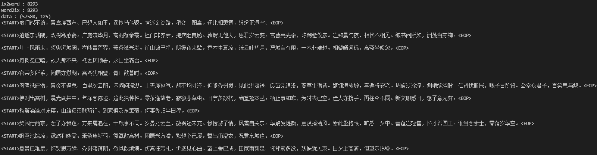
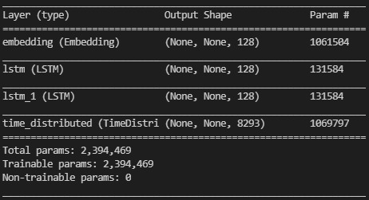
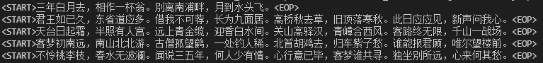
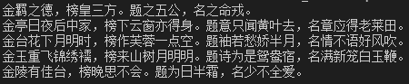

# 实验3：自动写诗

## 实验内容

### 数据集

实验原始数据集来自https://github.com/chinese-poetry/chinese-poetry。本次实验使用课程网站提供的预处理的数据集，含有57580首唐诗，每首诗限定在125词，不足125词的以`</s>`填充。数据集以npz文件形式保存，包含三个部分：

- data : 诗词数据，将诗词中的字转化为其在字典中的序号表示
- ix2word ：序号到字的映射
- word2ix：字到序号的映射



### 网络架构


网络架构分4层，分别是Embedding层、LSTM-1层、LSTM-2层和TimeDistributed层。

- Embedding层

  嵌入层Embedding的主要作用是对句子每个字进行特定维度的编码，即把每一个词都映射到高维空间。one-hot编码的向量维数十分高，而且非常稀疏，一方面计算效率低，另一方面无法体现词与词之间的关系。而Embedding编码能指定编码到特定的维数，使得每一个词不仅在高维空间能唯一表达，也能体现词与词之间的关系。在训练神经网络过程中，每个词向量都会得到更新，让Embedding层学习到词与词之间的关系。

  > 参考1：https://www.jiqizhixin.com/articles/2019-03-27-7
  >
  > 参考2：[李宏毅 Embedding笔记](https://blueschang.github.io/2018/12/25/%E3%80%8C%E6%9D%8E%E5%AE%8F%E6%AF%85%E6%9C%BA%E5%99%A8%E5%AD%A6%E4%B9%A0%E3%80%8D%E5%AD%A6%E4%B9%A0%E7%AC%94%E8%AE%B0-Unsupervised%20Learning%20-%20Word%20Embedding/)

- LSTM层

  长短期记忆细胞，RNN的基础单元。它由三个门控制进程细胞的信息流动，能有效解决长时间依赖问题和梯度消失等问题。

  

- TimeDistributed层

  由于本次实验RNN设计为多对多（many to many），TimeDistributed层用于在每个时间步上均操作了相同Dense。如果使用正常的Dense层，最后只会得到一个结果，即变为多对一。

  

  > 参考1：https://github.com/keras-team/keras/issues/1029
  >
  > 参考2：https://blog.csdn.net/u012193416/article/details/79477220
  >
  > 参考3：https://blog.csdn.net/LaoChengZier/article/details/88706642

网络模型的代码如下。

```python
# 构建模型
rnn_model = tf.keras.Sequential([
    # 不定长度的输入
    tf.keras.layers.Input((None,)), # [batch, seq_len]
    # 词嵌入层 '''Embedding的理解：https://www.jiqizhixin.com/articles/2019-03-27-7'''
    tf.keras.layers.Embedding(input_dim=settings.VOCAB_SIZE, output_dim=128), # [batch, seq_len] => [batch, seq_len, embed_dim]
    # 第一个LSTM层，返回序列作为下一层的输入 
    tf.keras.layers.LSTM(128, dropout=0.5, return_sequences=True), # [batch, seq_len, embed_dim] => [batch, seq_len, lstm1_dim]
    # 第二个LSTM层，返回序列作为下一层的输入
    tf.keras.layers.LSTM(128, dropout=0.5, return_sequences=True), # [batch, seq_len, lstm1_dim] => [batch, seq_len, lstm2_dim]
    # 对每一个时间点的输出都做softmax，预测下一个词的概率 '''TimeDistributed的理解：https://blog.csdn.net/u012193416/article/details/79477220 '''
    tf.keras.layers.TimeDistributed(tf.keras.layers.Dense(settings.VOCAB_SIZE, activation='softmax')),  # [batch, seq_len, vocab_size] | 理解：seq_len长度的每个词的在字典(vocab)概率分布 
])

# 查看模型结构
rnn_model.summary()
# 配置优化器和损失函数
rnn_model.compile(optimizer=tf.keras.optimizers.Adam(), loss=tf.keras.losses.categorical_crossentropy)
```

网络模型的输出和参数细节如下。



## 实验环境

### 运行依赖

Python3.8.8

- tensorflow-2.2：神经网络框架
- numpy：科学计算包
- datetime：时间管理器
- os：系统文件管理器

### 运行环境

GPU：GeoForce GTX 1660 Ti with Max-Q Design

## 实验流程

### 训练流程

1. 首先将预处理的数据集中每首诗歌的`<\s>`去除，保留`<START>,<EOP>`，然后在一个batch size （16）内计算长度最长的诗歌，接着使用`<\s>`其他诗歌填充到与其相同的长度。这样做的目的是为了节约每个batch size所占有的内存。（原始的长度固定为125，但是有部分诗歌长度远小于125，填充`<\s>`过多，浪费内存）。

2. 将诗的内容错开一位分别作为数据和标签，例如

   - 输入: [START] 床 前 明 月 光  ， 疑 是 地 上 霜  。 举 头 望 明 月 ， 低 头 思 故 乡   。
   - 输出:      床      前 明 月 光  ， 疑 是 地 上 霜  。 举 头 望 明 月 ， 低 头 思 故 乡 。 [EOP]

   还有一点需要注意的是，标签部分使用了one-hot进行处理，而数据部分没有使用。 原因在于，数据部分准备输入词嵌入层，而词嵌入层的输入不需要进行one-hot；而标签部分，需要和模型的输出计算交叉熵，输出层的激活函数是softmax，所以标签部分也要转成相应的shape，故使用one-hot形式。

3. 损失函数选择交叉熵损失，优化器选用Adam，学习率为0.001，其他参数默认，迭代20个epochs。
4. 除了观察损失变化之外，由于自动写诗无法通过损失的变化来衡量模型的效果，所有在每个epoch结束后，随机生成一定数量的古诗，来主观评价的写诗的学习效果。

数据和标签制作流程代码如下。

```python
class PoetryDataGenerator:
    """
    古诗数据集生成器
    """

    def __init__(self, data, random=False):
        # 数据集
        self.data = data
        # batch size
        self.batch_size = settings.BATCH_SIZE
        # 每个epoch迭代的步数
        self.steps = int(math.floor(len(self.data) / self.batch_size))
        # 每个epoch开始时是否随机混洗
        self.random = random

    def __len__(self):
        return self.steps


    def sequence_padding(self, data, length=None, padding=None):
        """
        将给定数据填充到相同长度
        :param data: 待填充数据
        :param length: 填充后的长度，不传递此参数则使用data中的最大长度
        :param padding: 用于填充的数据，不传递此参数则使用[PAD]的对应编号
        :return: 填充后的数据
        """
        # 计算填充长度
        if length is None:
            length = max(map(len, data)) # batch_size 最长的长度
        # 计算填充数据
        if padding is None:
            padding = 8292
        # 开始填充
        outputs = []
        for line in data:
            padding_length = length - len(line)
            # 不足就进行填充
            if padding_length > 0:
                outputs.append(np.concatenate([line, [padding] * padding_length]))
            # 超过就进行截断
            else:
                outputs.append(line[:length])
        return np.array(outputs)

    def __iter__(self):
        total = len(self.data)
        # 是否随机混洗
        if self.random:
            np.random.shuffle(self.data)
        # 迭代一个epoch，每次yield一个batch
        for start in range(0, total, self.batch_size):
            end = min(start + self.batch_size, total)
            batch_data = self.data[start:end]
            # 填充为相同长度
            batch_data = self.sequence_padding(batch_data)
            # print(batch_data, batch_data.shape)
            # yield x,y
            '''
                将诗的内容错开一位分别作为数据和标签
                    example:
                    输入: [START] 床 前 明 月 光 ， 疑 是 地 上 霜 。 举 头 望 明 月 ， 低 头 思 故 乡 。
                    输出: 床    前 明 月 光 ， 疑 是 地 上 霜 。 举 头 望 明 月 ， 低 头 思 故 乡 。 [EOP]
                还有一点不同的是，标签部分使用了one-hot进行处理，而数据部分没有使用。
                原因在于，数据部分准备输入词嵌入层，而词嵌入层的输入不需要进行one-hot；而标签部分，需要和模型的输出计算交叉熵，输出层的激活函数是softmax，所以标签部分也要转成相应的shape，故使用one-hot形式。
             '''
            yield batch_data[:, :-1], tf.one_hot(batch_data[:, 1:], settings.VOCAB_SIZE)
            del batch_data

    def for_fit(self):
        """
        创建一个生成器，用于训练
            写成生成器的形式，主要出于内存方面的考虑。
            训练时需要对数据进行填充、转one-hot形式等操作，会占用较多内存。
            如果提前对全部数据都进行处理，内存可能会溢出。而以生成器的形式，可以只在要进行训练的时候，处理相应batch size的数据即可。
        """
        # 死循环，当数据训练一个epoch之后，重新迭代数据
        while True:
            # 委托生成器
            yield from self.__iter__()
```

### 预测流程

1. 初始化起始字符串`<START>`作为模型输入，模型预测下一个字（不包含`<START>,</s>`的概率）。
2. 将预测的字和上一个字拼接，作为新的模型输入，模型再接着预测下一个字。
3. 重复2过程，直到遇到`<EOP>`结束符或者达到最大诗歌长度阈值（64）。

本次实验实现两种方式的诗歌生成，分别是随机诗句和藏头诗，代码如下。

```python
def generate_random_poetry(word2ix, ix2word, model, s=settings.START_FLAG):
    '''
    随机生成一首诗
    :param word2ix: 文字映射序号
    :param ix2word: 序号映射文本
    :param model: 用于生成古诗的模型
    :param s: 用于生成古诗的起始字符串，默认为空串
    :return: 一个字符串，表示一首古诗
    '''
    # 将初始字符串转成token
    if s != settings.START_FLAG:
        token_ids = [settings.START_FLAG, s]
    else:
        token_ids = [s]
    while len(token_ids) < settings.MAX_LEN:
        # 进行预测，只保留第一个样例（我们输入的样例数只有1）的、最后一个token的预测的、不包含[START] </s>的概率分布
        # _probas = model.predict([token_ids, ]) # (1, seq_len, 8293)
        _probas = model.predict([token_ids, ])[0, -1, :-1] # (8292, )
        # print(_probas)
        # 按照出现概率，对所有token倒序排列，取前100
        p_args = _probas.argsort()[::-1][:100]
        # 排列后的概率顺序
        p = _probas[p_args]
        # 先对概率归一
        p = p / sum(p)
        # 再按照预测出的概率，随机选择一个词作为预测结果
        target_index = np.random.choice(len(p), p=p)
        target = p_args[target_index]
        # 保存
        token_ids.append(target)
        if target == settings.EOP_FLAG:
            break
        # print(token_ids)

    # 解码诗句
    poetry = ''
    for i in token_ids:
        poetry_word = ix2word.item()[i] # loaded_dict，使用.item（）方法访问字典。
        poetry += poetry_word
            
    return poetry


def generate_acrostic(word2ix, ix2word, model, head):
    '''
    随机生成一首藏头诗
    :param word2ix: 文字映射序号
    :param ix2word: 序号映射文本
    :param model: 用于生成古诗的模型
    :param head: 藏头诗的头
    :return: 一个字符串，表示一首古诗
    '''
    # 使用空串初始化token_ids，加入[START]
    token_ids = [settings.START_FLAG]
    # 标点符号，这里简单的只把逗号和句号作为标点
    punctuation_ids = [settings.COMMA_FLAT, settings.FULL_STOP_FLAT]
    # 缓存生成的诗的list
    poetry = []
    # 对于藏头诗中的每一个字，都生成一个短句
    for ch in head:
        # 先记录下这个字
        poetry.append(ch)
        # 将藏头诗的字符转成token id
        token_id = word2ix.item()[ch]
        # 加入到列表中去
        token_ids.append(token_id)
        # 开始生成一个短句
        while True:
            # 进行预测，只保留第一个样例（我们输入的样例数只有1）的、最后一个token的预测的、不包含[START] </s>的概率分布
            _probas = model.predict([token_ids, ])[0, -1, :-1]
            # 按照出现概率，对所有token倒序排列，取前100
            p_args = _probas.argsort()[::-1][:100]
            # 排列后的概率顺序
            p = _probas[p_args]
            # 先对概率归一
            p = p / sum(p)
            # 再按照预测出的概率，随机选择一个词作为预测结果
            target_index = np.random.choice(len(p), p=p)
            target = p_args[target_index]
            # 保存
            token_ids.append(target)
            # 只有不是特殊字符时，才保存到poetry里面去
            if target < 8290:
                poetry.append(ix2word.item()[target])
                # print(poetry)
            if target in punctuation_ids:
                break
    return ''.join(poetry)
```

## 实验结果

### 损失变化


20epochs内，损失的变化情况如上图所示，最终的损失降为**3.325**。

### 随机诗句生成

随机生成5首诗歌，效果如下。



### 藏头诗生成

以金榜题名为藏头，写5首藏头诗，效果如下。



虽然诗歌的词语表达的连贯性和通达性不够完美，但是其在句式上是正确的，部分的诗句还是有一定的唐诗风范，说明网络有一定的学习到诗歌的句式和意境。	