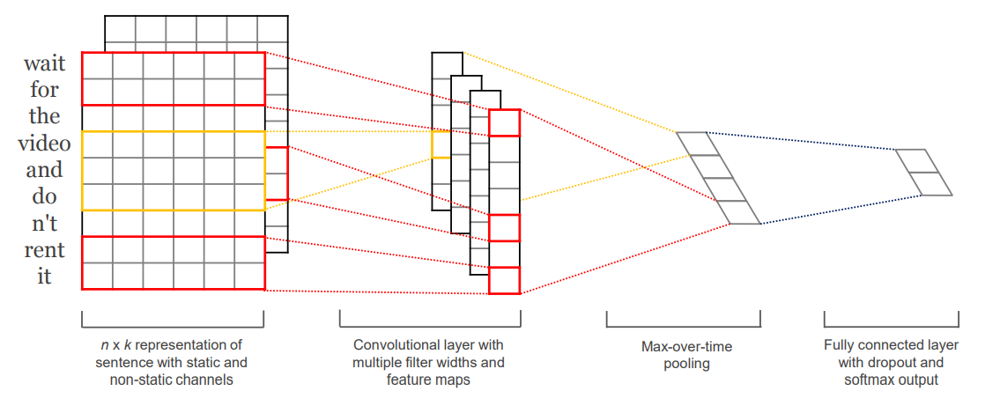
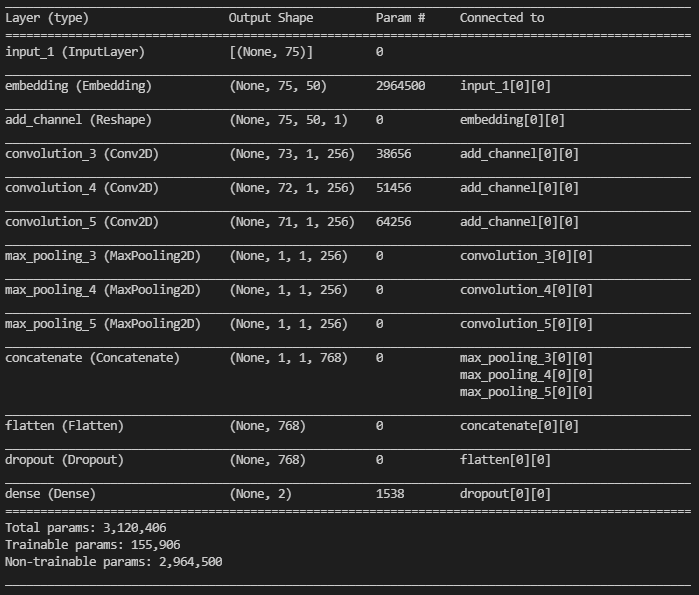
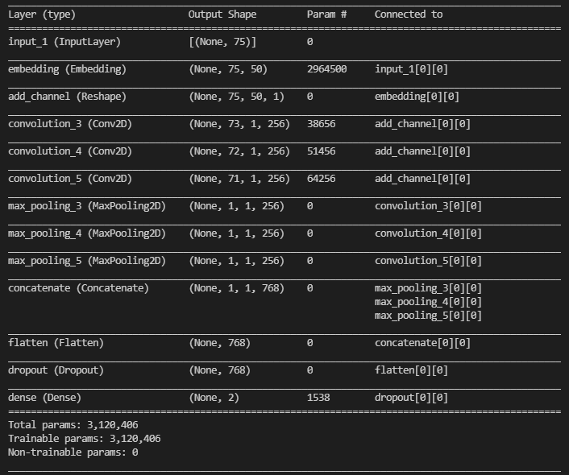
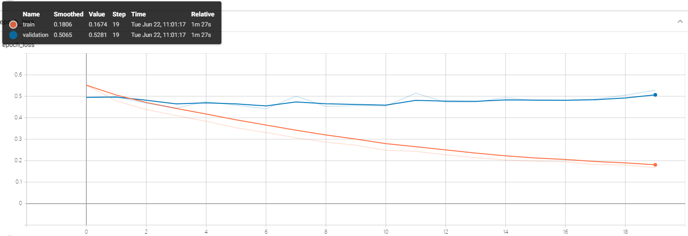
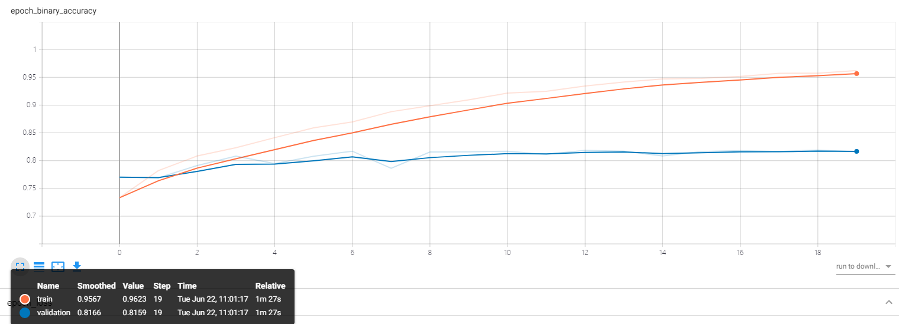
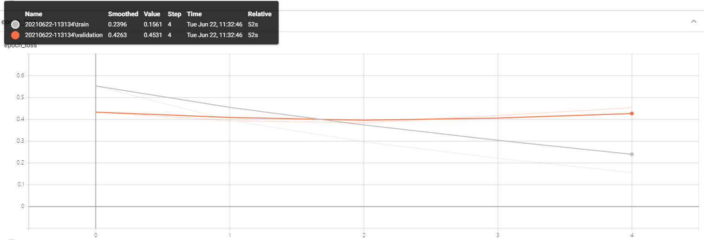
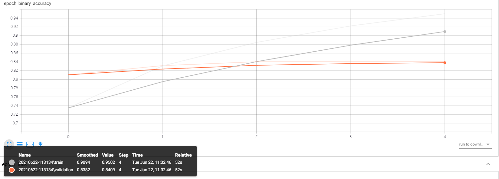

# 实验4：情感分类

## 实验内容

### 数据集

本次实验数据集来自课程网站，由三部分组成，分别是：

- 训练集：包含2W条左右中文电影评论，其中正负向评论各1W条左右。
- 验证集：包括6K条左右中文电影评论，其中正负向评论各3K条左右。
- 测试集：包含360条左右中文电影评论，其中正负向评论各180条左右。
- 预训练词向量：中文维基百科词向量 word2vec

```
1	离奇 简单 简单 无聊 毫无 意思 一个 故事 毫无 意思 一个 角色 就算 没有 NC 演 也 不会 更差 就算 NC 演 也 一样 无聊 被 女巫 题材 吸引 其实 根本 不是 女巫 悲剧
1	这部 电视剧 很能 锻炼 人 平时 看 国产片 我 只会 一边 看 一边 玩 手机 这部 片子 却 能 无聊 让 我 一边 玩 手机 一边 看书 一边 听 音乐 看 两眼 而且 即使 这样 居然 不会 因 错过 剧情 而 产生 疑惑 是不是 灰常 强大 很 垃圾 要说 人物 呃 我 喜欢 艾莉
1	苍白 文艺片 几乎 忘记 是否 看过 原著 电影 里 若干 情节 均 未 唤醒 对 文字 半点 记忆 女主角 阴气 很 重 整部 影片 象 鬼片 一般 尤其 直子 冬季 死去 镜头 还有 男主角 伴随 交响乐 伴奏 鼻涕 眼泪 横流 海边 哭泣 十分 人 无语
1	那个 baby 怎么 跑 也 追不上 幸福 悠闲 听 歌 骑 三轮 卖 西瓜 不分 季节 风衣 男 最后 baby 瘫软 地上 眼中 闪烁着 热泪盈眶 泪珠 悄然 注视 远去 幸福 悠闲 听 歌 骑 三轮 卖 西瓜 不分 季节 风衣 男 爱情 太 残酷
1	说实话 没有 好好看 新版 阿甘 虽然 男主 智商 高 但 还是 有点 换汤 不过 换药 一定 程度 励志 只要 坚持 会 奇迹 我 收获 关于 穆斯林 人们 总是 这样 因为 一个 群体 里 一个 人 错误 而 否认 整个 群体

0	三浦 春马 眼睛 像 星星 一样 闪闪发亮 我 口水 不受 控制 小朋友 一定 要 爱护 自己 不要 让 某些 事 过早 发生 弘树 个 满有 担当 男孩子 真 可惜 LP 说 看 小说 看不下去 女主太 自我 萝莉 嘻嘻 我无语
0	过于 血腥 暴力 裸露 对此 敏感 者 建议 不看 反之 情节 第 集 开始 集 到达 高潮 交织 一起 颇 有些 古希腊 悲剧 味道 也 可以 说 奴隶 正当 史诗 期待 第二季 ps 另外 复仇 总能 吸引 眼球 比如 基督山 伯爵
0	又 贴 一堆 标签 感谢 导演 没 故作高深 让 看过 原著 却 被 译者 弄 晕 我 理清 思路 感叹 GO 戏份 少 影帝 会 不会 危险 BC 倒 个 大 龙套 剩下 除了 CF 炮灰 结尾 歌曲 一扫 伦敦 阴霾 把 我 带入 法国 午后 阳光 中 原著 结尾 形成 鲜明对比 难以形容 这种 感觉 对味 与否
0	部 关于 孩子 片子 却 让 我 看到 许多 孩子 以外 珍贵 东西 这个 物欲横流 社会 多少 人会 为了 亲人 放弃 巨大 财富 如果 你 你 会 做 怎样 选择 剧中 孩子 教会 我们 忽略 很 久 东西 看 这部 片子 会 让 你 学会 很多
0	片子 细节 部分 符合 他 以往 风格 细腻 华丽 而且 把 故事 讲得 很 好 里面 书娟 演员 总给 我 一种 穿 汤 唯 赶脚 玉墨 风情 果然 不错 长 不是 算 漂亮 但是 那股 风韵 真的 很 好
```

以上是部分数据的展示，其中可以看到中文内容是已经经过预处理进行分词的，其中1是负面，0是正面。

### 网络架构

本次实验采用的网络架构是实验指导书中推荐的Text-CNN，来自于《Convolutional Neural Networks for Sentence Classification》一文。其结构如下图所示。



Text-CNN由四层结构组成，分别是词嵌入层、卷积层、池化层和全连接层。

- 词嵌入层：将输入文本的每个词语通过空间映射，转化为向量，进而可以使用低维的向量来表示每一个词语。将各个词语的向量表示连接起来便可以得到二维矩阵。

  数学描述即为，假设假设$x_i \in R^{k}$代表在句子中第$i$个词的词向量，一个句子长度为$n$（必要时填充），那么可以表达为：
  $$
  x_{1:n} = x_1 \oplus x_2 ... \oplus x_n \tag{1}
  $$
  其中$\oplus$代表串联。通常$x_{i:i+j}$可以表示为词$x_i,x_{i+1},x_{i+j}$的串联。

- 卷积层：利用卷积层提取词与词之间的卷积特征，即句子局部特征。卷积层的卷积核的宽度等于词向量的维度，卷积核的长度一般设置为3、4、5（论文实验配置）。可以设置多个卷积核提取文本的多层特征。

  数学描述即为，一个卷积操作包含卷积核$w \in R^{hk}$，即使用窗口大小为$h×k$，（$h$是词数量，$k$是编码维度）来生成一个新特征。比如特征$c_i$是由窗口内的词$x_{i:i+h-1}$生成，即
  $$
  c_i = f(w · x_{i:i+h-1} +b) \tag{2}
  $$
  其中$b \in R$是偏置项，$f$是非线性函数。这个卷积核遍历整个句子的词$\{x_{1:h},x_{2:h+1},...,x_{n-h+1:n}\}$用于生成特征图
  $$
  c = [c_1,c_2,...,c_{n-h+1}]
  $$
  其中$c \in R_{n-h+1}$。

- 池化层：一般采取 max pooling，池化大小与特征图一致，提取特征图取最大值，即每个特征图取最大值$\hat{c} = max\{c\}$。

- 全连接层：采用Dropout防止过拟合，神经元个数由句子类别决定，使用softmax函数输出各个类别的概率。

### 网络模型

构建网络模型的代码如下。

```python
def TextCNN(update_w2v, max_sen_len, embedding_matrix, embedding_dim, filters_size, num_filters, dropout_rate, num_classes, regularizers_lambda):
    '''
    @description: TextCNN模型
    @param 
        update_w2v 是否更新预训练词向量
        max_sen_len 句子长度
        embedding_matrix 预训练词向量
        embedding_dim 词向量维度
        filters_size 卷积核长度
        num_filters 卷积核个数
        dropout_rate 丢弃率
        num_classes 分类个数
        regularizers_lambda 正则化率
    @return model 模型
    '''    
    # 输入词向量（预训练词向量）
    inputs = keras.Input(shape = (max_sen_len, ), dtype = tf.uint16)

    # 词嵌入层
    embed = keras.layers.Embedding(
                                    settings.vocab_size, 
                                    settings.embedding_dim, 
                                    input_length= max_sen_len,
                                    embeddings_initializer = keras.initializers.Constant(embedding_matrix),
                                    trainable=update_w2v,
                                    name='embedding')(inputs)

    # 增加通道数
    feature_map = keras.layers.Reshape((max_sen_len, embedding_dim, 1), name='add_channel')(embed)

    pool_outputs = []

    # 定义不同大小的卷积核(3,4,5)，提取局部文本特征
    for filter_size in list(map(int, filters_size.split(','))):
        filter_shape = (filter_size, embedding_dim)

        conv = keras.layers.Conv2D( num_filters, 
                                    filter_shape, strides=(1,1), 
                                    padding='valid', 
                                    data_format='channels_last', 
                                    activation='relu', 
                                    name = 'convolution_{:d}'.format(filter_size))(feature_map)

        # max-over-time pooling
        max_pool_shape = (max_sen_len - filter_size + 1, 1)
        # print(max_pool_shape)
        pool = keras.layers.MaxPool2D(  pool_size= max_pool_shape, 
                                        strides=(1,1), 
                                        padding='valid', 
                                        data_format='channels_last', 
                                        name ='max_pooling_{:d}'.format(filter_size))(conv)

        pool_outputs.append(pool)
    # 拼接
    pool_outputs = keras.layers.concatenate(pool_outputs, axis = -1, name = 'concatenate') 
    # 展开
    pool_outputs = keras.layers.Flatten(data_format= 'channels_last', name = 'flatten')(pool_outputs)
    pool_outputs = keras.layers.Dropout(dropout_rate, name = 'dropout')(pool_outputs)

    outputs = keras.layers.Dense( num_classes, 
                                  activation='softmax',
                                  kernel_regularizer= keras.regularizers.l2(regularizers_lambda),
                                  bias_regularizer=keras.regularizers.l2(regularizers_lambda),
                                  name = 'dense')(pool_outputs)
    
    model = keras.Model(inputs = inputs, outputs = outputs)

    return model
```

## 实验环境

### 运行依赖

Python3.8.8

- tensorflow-2.2：神经网络框架
- numpy：科学计算包
- datetime：时间管理器
- os：系统文件管理器
- gensim：一款开源的第三方Python工具包，用于从原始的非结构化的文本中，无监督地学习到文本隐层的主题向量表达。

### 运行环境

GPU：GeoForce GTX 1660 Ti with Max-Q Design

## 实验流程

### 数据预处理

1. 读取训练、验证和测试数据，为每个词建立映射id。

   ```python
   def build_word2id(file = None):
       """
       :param file: word2id保存地址
       :return: None
       """
       word2id = {'_PAD_': 0}
       path = ['./data/train.txt', './data/validation.txt', './data/test.txt']
       # print(path)
       for _path in path:
           with open(_path, encoding='utf-8') as f:
               for line in f.readlines():
                   sp = line.strip().split()
                   for word in sp[1:]:
                       if word not in word2id.keys():
                           word2id[word] = len(word2id)
   
       # print(len(word2id)) # 58954
   
       if file :
           with open(file, 'w', encoding='utf-8') as f:
               for w in word2id:
                   f.write(w+'\t')
                   f.write(str(word2id[w]))
                   f.write('\n')
       
       return word2id
   ```

2. 加载预训练词向量，为每个词映射id分配50维的词向量，将其保存为numpy文件。

   ```python
   def build_word2vec(fname, word2id, save_to_path=None):
       """
       :param fname: 预训练的word2vec.
       :param word2id: 语料文本中包含的词汇集.
       :param save_to_path: 保存训练语料库中的词组对应的word2vec到本地
       :return: 语料文本中词汇集对应的word2vec向量{id: word2vec}.
       """
       n_words = max(word2id.values()) + 1
       model = gensim.models.KeyedVectors.load_word2vec_format(fname, binary=True)
       word_vecs = np.array(np.random.uniform(-1., 1., [n_words, model.vector_size]))
       for word in word2id.keys():
           try:
               word_vecs[word2id[word]] = model[word]
           except KeyError:
               pass
       if save_to_path:
           np.save(save_to_path, word_vecs)
       return word_vecs
   ```

3. 构建数据和标签，数据是将每条评论句子先填充到相同的长度（实验中设置为75），然后每个词映射相应词向量；标签是one-hot编码的正负。经过数据预处理，数据的格式如下：

   ```
   x:[[[ 0.16421488 -0.10851765  0.19503653 ... -0.49863487  0.25939196
      -0.2625526 ]
     [ 0.36876917 -0.14839791  0.00680677 ... -0.5649007   0.34907597
      -0.5528553 ]
     [ 0.502994    0.35621735  0.39537403 ... -0.69790655  0.44487333
      -0.51679176]
     ...
     [ 0.38118738  0.7449859  -0.31743434 ... -0.1905132   0.81832397
      -0.6746917 ]
     [ 0.38118738  0.7449859  -0.31743434 ... -0.1905132   0.81832397
      -0.6746917 ]
     [ 0.38118738  0.7449859  -0.31743434 ... -0.1905132   0.81832397
      -0.6746917 ]]] (1, 75, 50)
   y: [[0 1]] (1, 2)
   ```

### 预训练词向量（不更新）

#### 网络配置

- batch size ： 50
- epoch ：20
- learning rate ：0.001
- dropout rate ：0.5
- filters length：3，4，5
- 优化方法：Adma
- 损失函数：二值交叉熵损失函数
- 评估方法：二分类准确率

网络模型的输出和参数细节如下。



### 词向量（更新）

#### 网络配置

- batch size ： 50
- epoch ：5
- learning rate ：0.001
- dropout rate ：0.8
- filters length：3，4，5
- 优化方法：Adma
- 损失函数：二值交叉熵损失函数
- 评估方法：二分类准确率

网络模型的输出和参数细节如下。



## 实验结果

### 预训练词向量（不更新）

#### 损失和正确率

- 损失函数

  

- 正确率

  

对于损失函数，在20epoch内，训练集损失降低到**0.1806**，验证集损失降低到**0.5065**；对于正确率曲线，在20epoch内，训练集正确率达到**95.67%**，验证集正确率为**81.59%**。初步分析，虽然增加了Dropout层，但是模型依然出现了过拟合现象，后续改进可能从增大Dropout rate和减少训练epoch出发。

#### 测试集结果

在测试集上测试的正确率为**81.47%**，未达到实验报告的要求。

### 预训练词向量（更新）

#### 损失和正确率

- 损失函数

  

- 正确率

  

对于损失函数，在5epoch内，训练集损失降低到**0.2396**，验证集损失降低到**0.4263**；对于正确率曲线，在5epoch内，训练集正确率达到**90.94%**，验证集正确率为**84.09%**。初步分析，首先在微调更新词向量后，验证集的正确率能比不更新词向量高2~3%，其次虽然减少了epoch，增加了Dropout rate，但是过拟合现象依然存在，后续改进从数据增强、缩小网络规模、重新训练词向量和增加过拟合策略出发。

#### 测试集结果

在测试集上测试的正确率为**84.74%**，达到实验报告的要求。

