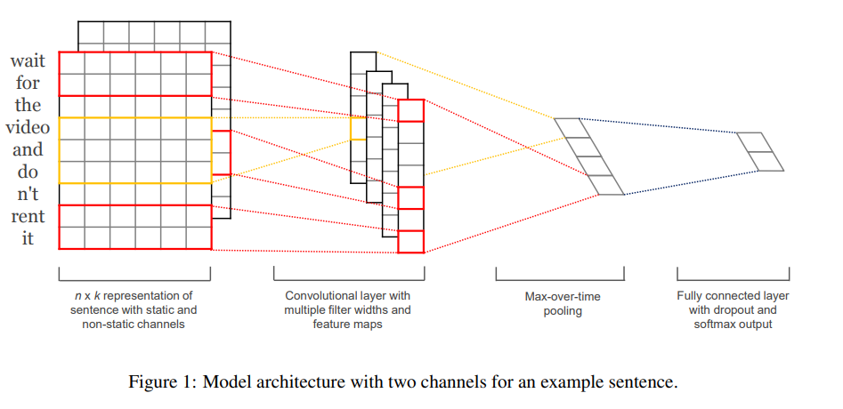

# Convolutional Neural Networks for Sentence Classification

## 摘要

我们报告了在预训练词向量之上训练的卷积神经网络 (CNN) 的一系列实验，用于句子级分类任务。 我们表明，具有很少超参数调整和静态向量的简单 CNN 在多个基准测试中取得了出色的结果。 通过微调学习特定于任务的向量可进一步提高性能。 我们还建议对架构进行简单的修改，以允许使用特定于任务的向量和静态向量。 此处讨论的 CNN 模型在 7 个任务中的 4 个任务上改进了现有技术，其中包括情感分析和问题分类。

## 引言

近年来，深度学习模型在计算机视觉（Krizhevsky et al., 2012）和语音识别（Graves et al., 2013）方面取得了显著成果。在自然语言处理中，深度学习方法的大部分工作都涉及通过神经语言模型学习词向量表示（Bengio 等人，2003 年；Yih 等人，2011 年；Mikolov 等人，2013 年）和执行组合用于分类的学习词向量（Collobert 等，2011）。单词向量，其中单词从稀疏的 1-of-V 编码（这里 V 是词汇量大小）通过隐藏层投影到较低维度的向量空间，本质上是特征提取器，在它们的维度上对单词的语义特征进行编码。在这样的密集表示中，语义接近的词在低维向量空间中同样接近——在欧几里得或余弦距离上。

卷积神经网络 (CNN) 使用带有卷积过滤器的层，这些过滤器应用于局部特征（LeCun 等人，1998 年）。 CNN 模型最初是为计算机视觉而发明的，后来被证明对 NLP 有效，并在语义解析（Yih 等人，2014 年）、搜索查询检索（Shen 等人，2014 年）、句子建模（Kalch brenner 等人，2014）和其他传统的 NLP 任务（Collobert 等人，2011 年）。

在目前的工作中，我们训练了一个简单的 CNN，在从无监督神经语言模型中获得的词向量上有一层卷积。这些向量由 Mikolov 等人训练。 (2013) 在谷歌新闻的 1000 亿个单词上，并且是公开可用的。我们最初保持词向量静态，只学习模型的其他参数。尽管很少调整超参数，但这个简单的模型在多个基准测试中取得了出色的结果，这表明预训练的向量是可用于各种分类任务的“通用”特征提取器。通过微调学习特定于任务的向量会导致进一步的改进。我们最终描述了对架构的简单修改，以允许通过具有多个通道来使用预训练和特定于任务的向量。

我们的工作在哲学上类似于 Razavian 等人。 (2014) 表明，对于图像分类，从预训练的深度学习模型获得的特征提取器在各种任务上表现良好——包括与特征提取器训练的原始任务非常不同的任务。

## 模型

### 模型数学描述

假设$x_i \in R^{k}$代表在句子中第$i$个词的词向量，一个句子长度为$n$（必要时填充），那么可以表达为：
$$
x_{1:n} = x_1 \oplus x_2 ... \oplus x_n \tag{1}
$$
其中$\oplus$代表串联。通常$x_{i:i+j}$可以表示为词$x_i,x_{i+1},x_{i+j}$的串联。

一个卷积操作包含卷积核$w \in R^{hk}$，即使用窗口大小为$h×k$，（$h$是词数量，$k$是编码维度）来生成一个新特征。比如特征$c_i$是由窗口内的词$x_{i:i+h-1}$生成，即
$$
c_i = f(w · x_{i:i+h-1} +b) \tag{2}
$$
其中$b \in R$是偏置项，$f$是非线性函数。这个卷积核遍历整个句子的词$\{x_{1:h},x_{2:h+1},...,x_{n-h+1:n}\}$用于生成特征图
$$
c = [c_1,c_2,...,c_{n-h+1}]
$$
其中$c \in R_{n-h+1}$。接着应用`max-over-time pooling`的操作，对每个特征图取最大值$\hat{c} = max\{c\}$。

以上过程描述是采用一个卷积核提取一个特征，在模型中通常使用多个卷积核（带有不同窗口大小）来获得多个特征。这些特征拼接在一起形成列向量（倒数第二层），接着使用全连接层用于分类，输出分类结果的概率分布。

### 模型参数细节

- 卷积核的$h = [3,4,5]$，卷积核个数为100
- Dropout rate = 0.5

- 预训练的词向量

> 参考：https://zhuanlan.zhihu.com/p/37978321

